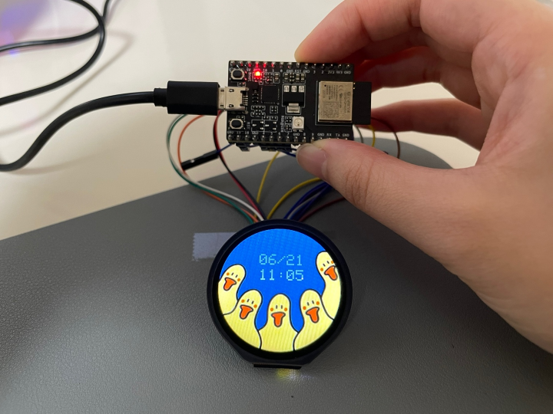
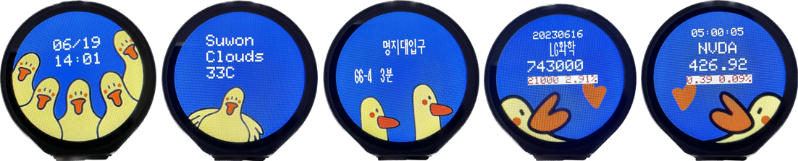
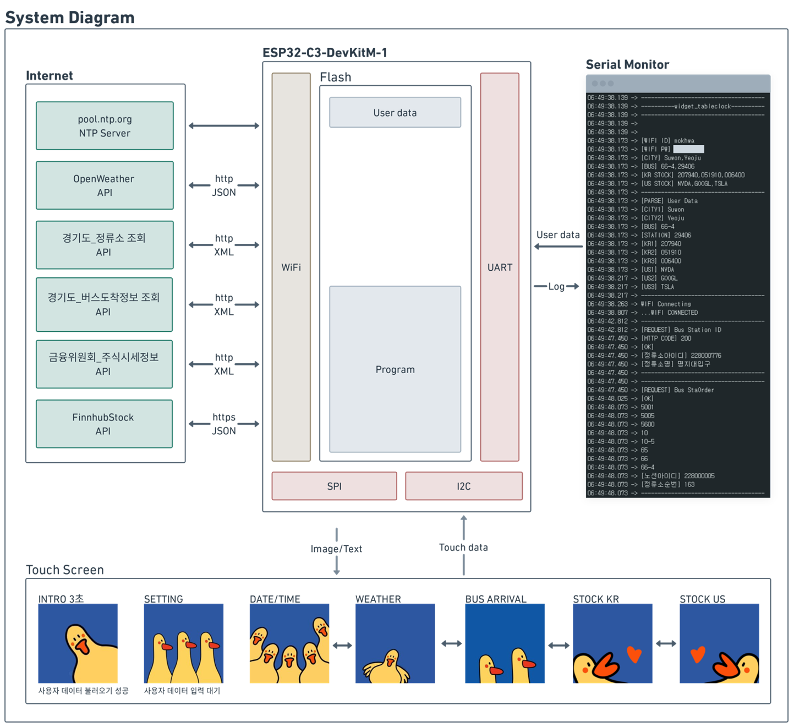
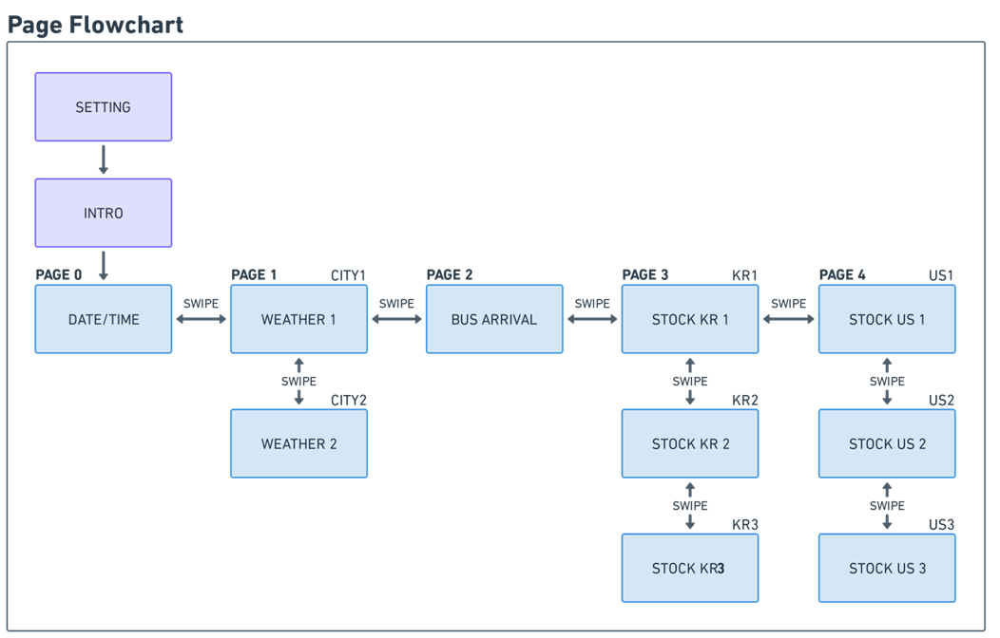
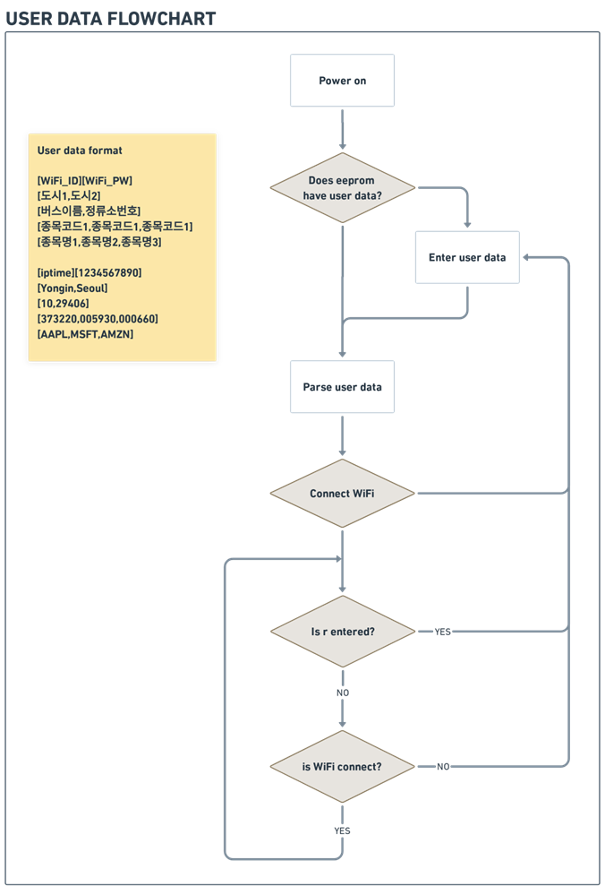
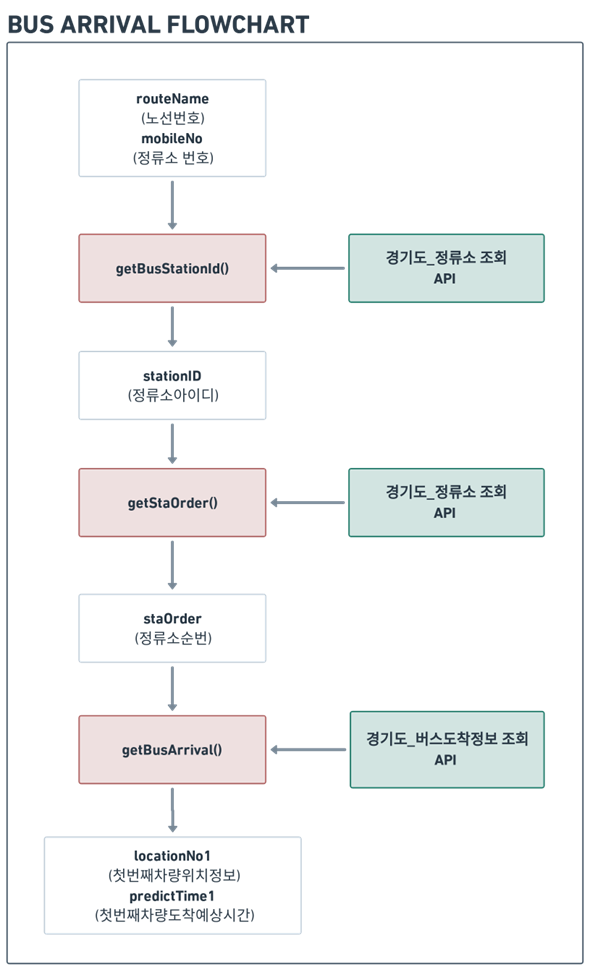

# IOT_TableClock

실용성있는 위젯을 추가한 IOT 탁상시계  
[>> 데모 영상 <<](https://youtu.be/ioXnSMVBpDA)  

  
  

## 개발환경  
- Arduino IDE 2.0.4
- [ESP32-C3-DevKitM-1](https://docs.espressif.com/projects/esp-idf/en/latest/esp32c3/hw-reference/esp32c3/user-guide-devkitm-1.html)
    - [ESP32­-C3­-MINI-­1](https://www.espressif.com/sites/default/files/documentation/esp32-c3-mini-1_datasheet_en.pdf)
    - [ESP32-C3FN4](https://www.espressif.com/sites/default/files/documentation/esp32-c3_datasheet_en.pdf)
  - Partition Scheme : Huge APP (3MB)   
- [1.28 inch round Touch Display](https://www.waveshare.com/1.28inch-Touch-LCD.htm)
    - LCD controller : GC9A01
    - Touch controller : CST816S

## 시스템도
  

## 회로도
  

## 시나리오
  
  
  

## API
- [Weather API](https://openweathermap.org/)
- [경기도_정류소 조회](https://www.data.go.kr/iim/api/selectAPIAcountView.do)
- [경기도_버스도착정보 조회](https://www.data.go.kr/data/15080346/openapi.do)
- [금융위원회_주식시세정보](https://www.data.go.kr/iim/api/selectAPIAcountView.do)
- [Finnhub Stock API](https://finnhub.io/)

## 라이브러리
- [TFT_eSPI](https://github.com/Bodmer/TFT_eSPI)
  - `User_Setup.h` 헤더파일은 `문서\Arduino\libraries\TFT_eSPI`로 붙여넣기
- [AimHangul](https://blog.naver.com/PostView.nhn?isHttpsRedirect=true&blogId=sanguru&logNo=221854830624&parentCategoryNo=59&categoryNo=&viewDate=&isShowPopularPosts=false&from=postView)
  - TFT_eSPI 기반으로 디스플레이에 한글 출력
- [CST816S](https://github.com/fbiego/CST816S)
  - `uint8_t i2c_read(uint16_t addr, uint8_t reg_addr, uint8_t * reg_data, size_t length)`로 수정함
- [tinyxml2](https://github.com/leethomason/tinyxml2)
  - XML parser

## 참고자료
- [ESP32-S3 Round SPI TFT with Touch 1.28"](https://github.com/Makerfabs/ESP32-S3-Round-SPI-TFT-with-Touch-1.28)
  - display 동작 확인
- [ESP32 NTP Client-Server: Get Date and Time (Arduino IDE)](https://randomnerdtutorials.com/esp32-date-time-ntp-client-server-arduino/)
   - 현재 날짜/시각 알기
- [ESP32 HTTPS Requests (Arduino IDE)](https://randomnerdtutorials.com/esp32-https-requests/)
  - https 연결
- [EZGIFCOM](https://ezgif.com/)
  - 이미지 크기 조정
- [ImageConverter (UTFT)](http://www.rinkydinkelectronics.com/t_imageconverter565.php)
  - 이미지 -> C 파일(배열) 변환